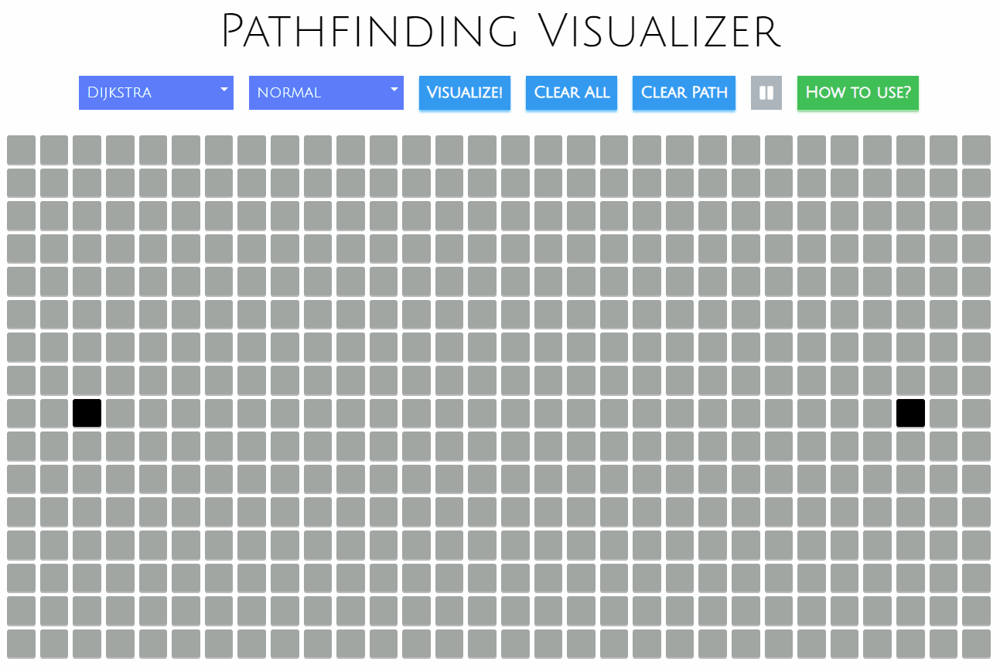
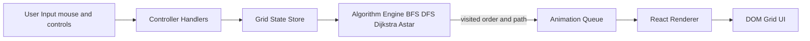
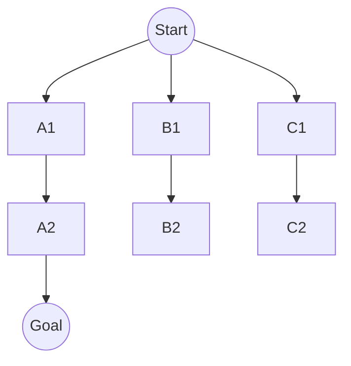
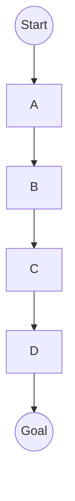
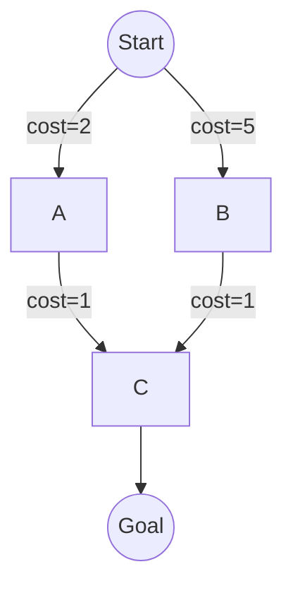
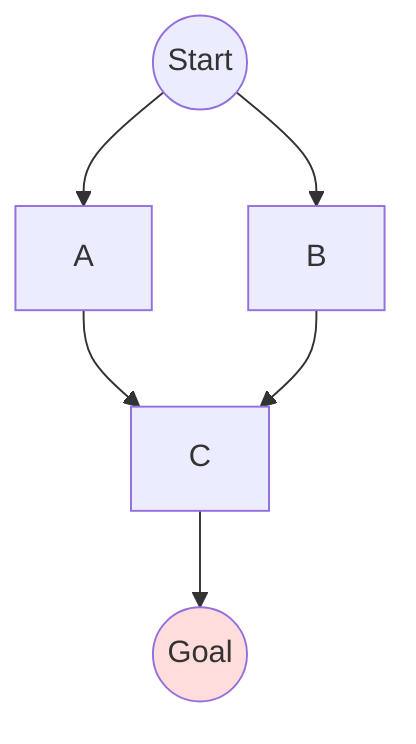
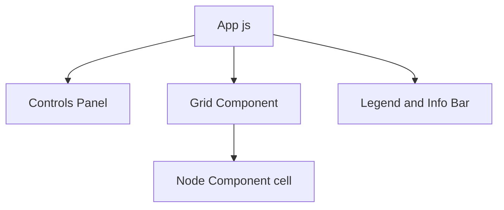
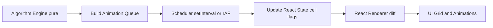
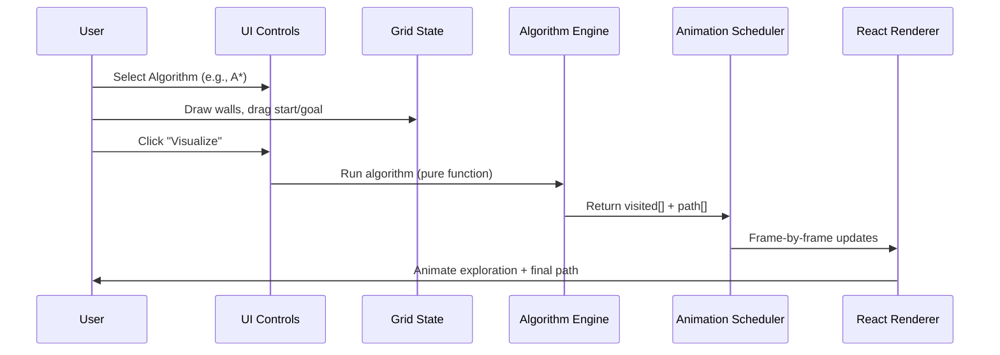

# Pathfinding-Visualizer — Interactive React Application

*Algorithmic search meets modern web engineering: visualize BFS, DFS, Dijkstra, and A* on a dynamic grid with real-time animations, metrics, and user interaction.*

---

<p align="center">
  
</p>

---

[**Live Demo**](https://devarshpatel1506.github.io/Pathfinding-Visualizer/)  
[**Source Code**](https://github.com/devarshpatel1506/Pathfinding-Visualizer)

---

## 1) Executive Summary

**On the surface:** This is an interactive **React single-page application** that lets users set start/goal nodes, draw obstacles, and visually compare how different pathfinding algorithms explore a grid.  

**Under the hood:** It’s an **SDE-quality project** that demonstrates:
- **Algorithm engineering** → BFS/DFS/Dijkstra/A* implemented as **pure, testable functions** separated from UI code.  
- **Complexity awareness** → correct handling of weighted vs. unweighted graphs, heuristics in A*, and clear trade-offs between optimality and speed.  
- **Front-end systems design** → decoupling of algorithm logic, state management, animation scheduling, and rendering.  
- **Performance-oriented UI** → O(1) grid updates, frame batching, and smooth requestAnimationFrame-driven animation.  
- **Software craftsmanship** → modular structure, React component decomposition, maintainable styles, and live deployment (GitHub Pages).

---

### 1.1 Why This Project Matters

- **Education**: Helps students and engineers see abstract graph algorithms in action.  
- **Engineering practice**: Shows how to design **separation of concerns** in a front-end system (algorithm engine vs. rendering engine).  
- **Interview readiness**: Proves fluency in **algorithms + data structures** *and* modern **front-end frameworks**.  
- **Portfolio polish**: Deployed, interactive, visually appealing, and technically rich.

---

### 1.2 Architecture (Conceptual)


- **Controller:**  
  - Listens to user events (place/remove walls, drag start/goal, select algorithm, adjust speed).  
- **State Store:**  
  - Keeps normalized grid data + algorithm options (rows/cols, diagonals, weights).  
- **Algorithm Engine:**  
  - Pure functions implementing **BFS, DFS, Dijkstra, and A\***.  
  - Returns:  
    - An ordered list of visited nodes (for animation).  
    - The final shortest path if found.  
- **Animation Queue:**  
  - Converts algorithm output into timed frames for playback.  
- **Renderer:**  
  - React components render the grid cells with efficient diffing.  
  - Animations applied via `requestAnimationFrame` for smooth playback.  

---

### 1.3 Features at a Glance

- **Algorithms implemented:**  
  - **BFS & DFS** → Unweighted; breadth vs. depth expansion  
  - **Dijkstra** → Weighted; guarantees optimal paths on non-negative weights  
  - **A\*** → Weighted + heuristic; faster optimal search (Manhattan / Euclidean heuristics)  

- **Grid operations:** click/drag to add/remove walls, drag start/goal, clear/reset grid  
- **Animation controls:** speed slider, play/pause, reset  
- **Visualization:** different cell coloring for frontier, visited, and final path  
- **Metrics shown:** nodes expanded, path length, runtime  
- **Deployment:** fully static **React SPA** deployed on GitHub Pages  

---

## 2) Pathfinding Algorithms — Theory, Correctness, and Implementation

The heart of this project is the implementation and visualization of **four canonical pathfinding algorithms**: **BFS, DFS, Dijkstra’s, and A***.  

Each algorithm is:
1. Implemented as a **pure function** (independent of UI).  
2. Accepts a **grid state** (rows, cols, walls, start, goal, optional weights).  
3. Produces:  
   - **Visited order** (for animation).  
   - **Shortest path** (if one exists).  

---

### 2.1 Breadth-First Search (BFS)

**Concept:** BFS explores in concentric “layers” from the start, ensuring the first time we reach the goal is the shortest path (on an unweighted graph).

**Key mechanics:**
- Uses a **FIFO queue**.
- Neighbors enqueued in fixed order (up, right, down, left) → deterministic.
- Tracks `visited` set and `prev` pointers for path reconstruction.

**Correctness:**
- Optimal for **unweighted grids** (minimizes edge count).
- Complexity:  
  - Time = O(V+E) (≈ O(R×C) for a grid).  
  - Space = O(V) (queue + visited set).  

**Diagram (mental model):**


- BFS expands outward evenly, like ripples in water.  

**Trade-offs:**
- Excellent for teaching optimality.  
- Memory-hungry for large grids.  

---

### 2.2 Depth-First Search (DFS)

**Concept:** DFS dives deep along one branch until it can’t continue, then backtracks.  

**Key mechanics:**
- Uses a **stack** (explicit or recursion).  
- No inherent shortest-path guarantee.  
- Prone to exploring dead ends.  

**Correctness:**
- Will eventually reach the goal (if connected), but not guaranteed to find the shortest path.  
- Complexity: O(V+E).  

**Diagram:**

- DFS looks like a “tunnel” exploration — long tendrils in one direction.  

**Trade-offs:**
- Low memory (stack depth = path length).  
- Inefficient for pathfinding — useful here as a counterexample.  

---

### 2.3 Dijkstra’s Algorithm

**Concept:** Extends BFS to weighted graphs by always expanding the **lowest-cost frontier node**.  

**Key mechanics:**
- Uses a **min-priority queue** (binary heap).  
- Maintains `dist[]` for each node (min known distance from start).  
- When we pop the goal, we know its shortest path distance.  

**Correctness:**
- Guarantees optimal path if weights ≥ 0.  
- Complexity: O((V+E) log V) with a heap.  

**Diagram (concept):**

- Dijkstra’s “frontier” expands unevenly, biased toward low-cost regions.  

**Trade-offs:**
- Slower than BFS (log factor from heap).  
- Foundation for A*.  

---

### 2.4 A* Search

**Concept:** Improves Dijkstra’s by adding a **heuristic** that estimates distance to goal.  
Chooses node with minimal `f(n) = g(n) + h(n)`.

- `g(n)` = actual cost from start.  
- `h(n)` = heuristic estimate to goal.  

**Heuristics used here:**
- **Manhattan distance** (|dx|+|dy|) for 4-direction movement.  
- **Euclidean distance** (√(dx²+dy²)) when diagonals allowed.  
- **Octile/Chebyshev** for mixed.  

**Correctness:**
- If `h` is **admissible** (never overestimates) and **consistent**, A* is optimal.  
- Complexity: O((V+E) log V), but **much faster in practice** than Dijkstra.  

**Diagram (intuition):**



- A* expansions visibly “cone” toward the target.  

**Trade-offs:**
- Requires heuristic design.  
- Poor heuristics degrade to Dijkstra.  

---

### 2.5 Algorithm Comparison Table

| Algorithm | Handles Weights | Uses Heuristic | Optimal? | Time Complexity | Space Complexity | Visual Style |
|-----------|----------------|----------------|----------|-----------------|------------------|--------------|
| **BFS**  | No             | No             | ✅ Shortest in unweighted | O(V+E) | O(V) | Circular ripple |
| **DFS**  | No             | No             | No        | O(V+E) | O(V) | Long tendrils |
| **Dijkstra** | Yes      | No             | Yes        | O((V+E) log V) | O(V) | Uneven ripples |
| **A***   | Yes          | Yes         | (admissible h) | O((V+E) log V) | O(V) | Cone toward goal |

---

### 2.6 Engineering Considerations

- **Data Structures:**  
  - Grids stored as 2D arrays of nodes `{row, col, dist, prev, isWall}`.  
  - BFS/DFS: arrays + queue/stack.  
  - Dijkstra/A*: binary heap (priority queue).  

- **Determinism:**  
  - Neighbors always expanded in a fixed order → consistent animations.  

- **Separation of Concerns:**  
  - Algorithms do not know about React or DOM.  
  - UI consumes only **visited[]** and **path[]** outputs.  

- **Animation Integration:**  
  - Output lists converted to timed frames in the **animation queue**.  
  - React only responsible for rendering, not computing.  

---

### 2.7 Visual Insights

- **DFS vs BFS:** DFS highlights why uninformed search is unreliable; BFS shows breadth exploration.  
- **Dijkstra vs A*:** Dijkstra is exhaustive; A* is directed.  
- **A* heuristics:** Different heuristics visibly change expansion shape.  

---

### Takeaway

This module demonstrates not just algorithm code, but a **deep grasp of correctness, complexity, heuristics, and software design**:
- Optimality conditions (unweighted vs weighted vs heuristic).  
- Algorithm–UI decoupling for testability.  
- Visual intuition of search efficiency and trade-offs.  

---

## 3) Frontend Architecture & Animation Pipeline

Beyond algorithms, the strength of this project is in how the **frontend system architecture** translates algorithm outputs into **smooth, interactive, real-time animations**.  
This section explains how React, state management, and the animation scheduler are designed to keep **UI performance high** while maintaining **separation of concerns**.

---

### 3.1 High-Level Component Hierarchy


- **App.js**  
  Top-level container; manages global state and orchestrates algorithm runs.
- **Controls Panel**  
  Dropdowns, buttons, and sliders for algorithm selection, speed, and clear/reset actions.
- **Grid Component**  
  Renders a 2D grid of **Node** components.
- **Node Component**  
  Represents a single cell (`start`, `goal`, `wall`, `visited`, `path`); handles click/drag interactions.
- **Legend**  
  Displays color meanings and live stats (visited count, path length, runtime).

---

### 3.2 State Management

The **grid** and **algorithm parameters** are modeled as a centralized state:

**Grid State**
- 2D array of nodes `{ row, col, isWall, isVisited, isPath, dist, prev }`  
- Start/goal coordinates tracked separately  

**Algorithm Options**
- Selected algorithm (**BFS, DFS, Dijkstra, A\*** )  
- Speed multiplier (ms per frame)  
- Toggle options: allow diagonal moves, weighted mode  

**Animation State**
- Queue of visited nodes  
- Queue of shortest path nodes  
- Current animation frame index  

---

### 3.3 Animation Pipeline

The key challenge: algorithms are **synchronous** but visualizations are **asynchronous**.

**Flow:**

1. **Algorithm run (pure):**  
   - Engine returns `visited[]` and `path[]`  

2. **Frame scheduling:**  
   - Wrap results into an animation queue  
   - Example:  
     ```js
     [
       { row: 0, col: 1, type: "visited" },
       { row: 0, col: 2, type: "visited" },
       ...
     ]
     ```

3. **Animation loop:**  
   - Timer or `requestAnimationFrame` dequeues frames at speed selected by user  
   - React state updated incrementally (O(1) per frame)  

4. **React render:**  
   - Node components re-render **only when their state changes** (thanks to keyed props)  

**Diagram**


### 3.4 Performance Optimizations

- **Minimal re-renders:** only changed cells trigger re-render → grid of 30×50 = 1500 nodes stays responsive  
- **Batching updates:** multiple cells per frame grouped → smoother animation  
- **rAF alignment:** `requestAnimationFrame` syncs with browser paint cycle → avoids jank  
- **CSS transitions:** cell color changes offloaded to GPU  
- **Time complexity:** each cell update O(1); total animation complexity O(V+E)  

---

### 3.5 Interaction Model

- **Placing walls:** click/drag across grid updates node flags  
- **Moving start/goal:** drag icons to reposition instantly  
- **Clearing/resetting:** buttons reset grid, path, or both  
- **Speed slider:** adjusts delay (fast = 10ms/cell, slow = 100ms/cell)  

---

### 3.6 UX Safeguards

- **Prevent double-runs:** disable controls while animation is active  
- **Staleness protection:** clearing grid cancels running animation  
- **Accessibility:** high-contrast cell colors, tooltips for controls  
- **Responsiveness:** layout adapts for desktop/tablet screen sizes  

---

## 4) User Features & Interactions

This section highlights the **functional features and UX design** that make the Pathfinding Visualizer both engaging and technically robust.  
Every interaction is tied to **clean state transitions** and **predictable rendering**, showcasing both **UI craftsmanship** and **engineering rigor**.

---

### 4.1 Core User Features

1. **Algorithm Selection**
   - Dropdown menu to pick BFS, DFS, Dijkstra, or A*.  
   - Each algorithm run reuses the same **engine → animation contract**.

2. **Grid Interaction**
   - **Click/drag to draw walls** — nodes marked `isWall=true`.  
   - **Erase walls** by clicking/dragging again.  
   - **Drag start/goal nodes** — instantly updates grid state.  

3. **Run/Reset Controls**
   - **Visualize** button triggers animation pipeline.  
   - **Clear path** resets visited/path highlights but keeps walls.  
   - **Clear grid** resets everything (walls, start/goal, paths).  

4. **Animation Control**
   - Speed slider → adjusts delay per frame (fast/medium/slow).  
   - Pause/Resume toggle (optional).  

5. **Maze Generation (optional extension)**
   - Prebuilt patterns (random walls, recursive division).  
   - Generates complex maps instantly for testing algorithm efficiency.  

---

### 4.2 Real-Time Metrics

- **Visited Count** → number of expanded nodes.  
- **Path Length** → number of steps in final shortest path (if found).  
- **Runtime** → time taken by algorithm execution (excluding animation).  
- **Optimality Badge** → marks BFS, Dijkstra, and A* (with admissible heuristic) as *optimal*, DFS as *not optimal*.  

These metrics help users **connect theory with results**.

---

### 4.3 Visual Feedback & States

- **Start Node**: Green (or customizable).  
- **Goal Node**: Red.  
- **Wall Node**: Black or dark grey.  
- **Visited Nodes**: Gradient blue → shows exploration wavefront.  
- **Path Nodes**: Yellow → final shortest path.  

**State transitions:**  
- Wall → visited → path → cleared.  
- React ensures only affected cells re-render.

---

### 4.4 UX Safeguards

- **Locking controls during animations** → prevents overlapping runs.  
- **Cancel-on-clear** → clearing grid stops animation loop safely.  
- **Deterministic ordering** → consistent outputs across runs.  
- **Responsive design** → grid resizes gracefully with window changes.  

---

### 4.5 Interaction Flow (User Journey)



## 5) Performance Considerations & Optimizations

Animating thousands of grid updates in a browser requires **careful engineering**.  
This section details the strategies used to ensure the Pathfinding Visualizer stays **smooth (40–60 FPS)**, **responsive to input**, and **scalable to larger grids**.

---

### 5.1 Performance Challenges

- **Grid Size**: With a default grid of ~30×50 = 1500 nodes, each node can change state multiple times per run.  
- **Animation Volume**: BFS/Dijkstra/A* may visit hundreds of nodes; animations could trigger thousands of DOM updates.  
- **React Overhead**: Naively updating every node re-render would cause slowdowns.  
- **Asynchronous Scheduling**: Algorithms compute instantly, but animations must be throttled for visualization.

---

### 5.2 Optimization Techniques

1. **Pure Algorithm Engine**
   - Algorithms run once, produce **visited[] + path[]** arrays.  
   - No DOM/React updates inside algorithm loop → avoids blocking.  
   - Decouples heavy compute from rendering.

2. **Batching Frame Updates**
   - Animation scheduler groups updates (e.g., 10–20 nodes per frame).  
   - Reduces re-renders while keeping animations perceptible.  

3. **requestAnimationFrame (rAF)**
   - Animations tied to browser paint cycle → ensures smooth rendering.  
   - Avoids `setTimeout` drift and layout thrash.  

4. **Minimal Re-Renders**
   - Each `Node` component only updates if its props (state) change.  
   - `React.memo` (or equivalent optimization) prevents redundant re-renders.  

5. **CSS Transitions**
   - State change → CSS class change.  
   - Browser GPU handles color animations, offloading work from JS.  

6. **O(1) Cell Updates**
   - State updates keyed by `(row,col)`.  
   - Direct map access ensures constant-time updates regardless of grid size.  

---

### 5.3 Scalability Benchmarks

- **Small grid (20×20, 400 nodes)** → instantaneous runs, animations trivial.  
- **Medium grid (30×50, 1500 nodes)** → smooth animations with batching (~60 FPS).  
- **Large grid (50×50, 2500 nodes)** → still feasible with batching (slight dip to ~40 FPS).  

---

### 5.4 Memory & State Management

- **Visited states** stored as booleans or short enums (`unvisited`, `visited`, `path`, `wall`).  
- **Algorithm outputs** stored once, reused for animation → prevents recomputation.  
- **Garbage minimization**: Reuse arrays/lists; avoid per-frame object creation.  

---

### 5.5 Interaction vs Animation

- **Lock controls** during visualization → avoids conflicting updates.  
- **Cancel on Clear** → halts animation queue safely, resets state.  
- **Throttle input** while dragging start/goal nodes → avoids event storming.  

---
## 6) Code & Architecture Quality

This project is structured to be **clean, modular, and maintainable**, highlighting strong SDE practices.

---

### 6.1 Separation of Concerns
- **Algorithms**: Pure functions, independent of UI, return `{visited[], path[]}`.  
- **State & Animation**: Scheduler consumes algorithm outputs, controls frame timing.  
- **UI Components**: React grid/cell components render state changes only.  

---

### 6.2 Testability
- Algorithms can be unit-tested on sample grids (deterministic outputs).  
- Pure logic → easy to validate correctness and complexity.  

---

### 6.3 Modularity
- `src/algorithms/` → BFS, DFS, Dijkstra, A*.  
- `src/components/` → Grid, Node, Controls.  
- `src/state/` → grid and animation store.  
- `src/styles/` → SCSS modules.  

---

### 6.4 Maintainability
- Adding a new algorithm requires **no UI changes** (engine contract consistent).  
- Components are reusable and decoupled.  
- Code organized for clarity and extension.

---

## 7) Deployment & Live Hosting

The project is packaged as a **static React SPA**, making deployment lightweight and repeatable.

---

### 7.1 GitHub Pages Deployment
- Built with `npm run build` → outputs `/build` folder.  
- Hosted via **GitHub Pages** (gh-pages branch).  
- CI/CD integration ensures push to `main` can auto-deploy to demo URL.  

**Live Demo:** [Pathfinding Visualizer](https://devarshpatel1506.github.io/Pathfinding-Visualizer/)

---

### 7.2 Why GitHub Pages
- Zero server dependencies → ideal for front-end-only apps.  
- CDN-backed → fast static asset delivery worldwide.  
- Simple integration with React Router (single-page app).   

---

## 8) Future Work & Extensions

While the current Pathfinding Visualizer is complete and production-ready, there are several opportunities to **extend functionality, add depth, and broaden educational scope**.

---

### 8.1 Algorithm Extensions
- **Greedy Best-First Search** → explores with heuristic only (fast but not optimal).  
- **Bidirectional Search** → run BFS/Dijkstra from both start and goal to cut search space.  
- **Jump Point Search (JPS)** → optimized A* for uniform-cost grids.  
- **Theta* or D* Lite** → advanced robotics/AI pathfinding algorithms.  

---

### 8.2 Visualization Enhancements
- **Side-by-side mode** → run two algorithms simultaneously for visual comparison.  
- **Step-through debugger** → manual “next step” mode for teaching.  
- **Heatmaps** → visualize cost fields or heuristic influence across grid.  
- **3D grids** → extend to cube/maze visualizations with WebGL (three.js + React).  

---

### 8.3 UX Improvements
- **Mobile-friendly UI** → touch-based wall drawing and drag controls.  
- **Save/Load grid states** → share scenarios or challenge others.  
- **Interactive tutorials** → guided explanations alongside animations.  
- **Dark mode** → accessibility and modern styling.  

---

### 8.4 Deployment & Scalability
- **Multi-platform hosting** → deploy also to Netlify/Vercel for redundancy.  
- **CI/CD with tests** → automated builds + unit tests for algorithms.  
- **Dockerized builds** → portable container for teaching labs.  

---

### 8.5 Educational Extensions
- **Algorithm quizzes** → ask users to predict path length or visited count.  
- **Explainability overlay** → show why a node was expanded (cost/heuristic breakdown).  
- **Data export** → log visited nodes and performance metrics for classroom analysis.  

---

## License

This project is licensed under the **MIT License** — you are free to use, copy, modify, and distribute it with attribution.  
See the [LICENSE](./LICENSE) file for details.


