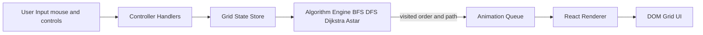

# Pathfinding-Visualizer — Interactive React Application

**Tagline:** *Algorithmic search meets modern web engineering: visualize BFS, DFS, Dijkstra, and A* on a dynamic grid with real-time animations, metrics, and user interaction.*

[▶ Live Demo](https://devarshpatel1506.github.io/Pathfinding-Visualizer/)  
[💻 Source Code](https://github.com/devarshpatel1506/Pathfinding-Visualizer)

---

## 1) Executive Summary

**On the surface:** This is an interactive **React single-page application** that lets users set start/goal nodes, draw obstacles, and visually compare how different pathfinding algorithms explore a grid.  

**Under the hood:** It’s an **SDE-quality project** that demonstrates:
- **Algorithm engineering** → BFS/DFS/Dijkstra/A* implemented as **pure, testable functions** separated from UI code.  
- **Complexity awareness** → correct handling of weighted vs. unweighted graphs, heuristics in A*, and clear trade-offs between optimality and speed.  
- **Front-end systems design** → decoupling of algorithm logic, state management, animation scheduling, and rendering.  
- **Performance-oriented UI** → O(1) grid updates, frame batching, and smooth requestAnimationFrame-driven animation.  
- **Software craftsmanship** → modular structure, React component decomposition, maintainable styles, and live deployment (GitHub Pages).

---

### 1.1 Why This Project Matters

- **Education**: Helps students and engineers see abstract graph algorithms in action.  
- **Engineering practice**: Shows how to design **separation of concerns** in a front-end system (algorithm engine vs. rendering engine).  
- **Interview readiness**: Proves fluency in **algorithms + data structures** *and* modern **front-end frameworks**.  
- **Portfolio polish**: Deployed, interactive, visually appealing, and technically rich.

---

### 1.2 Architecture (Conceptual)

